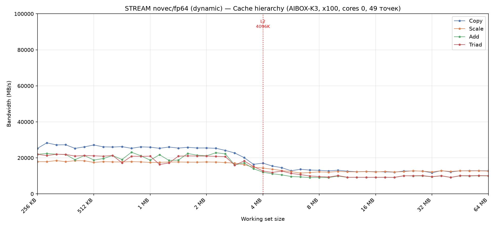
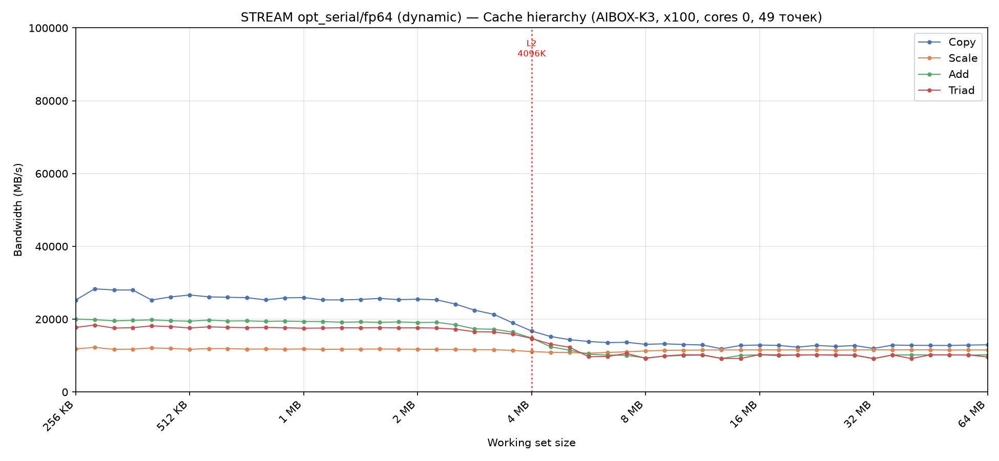
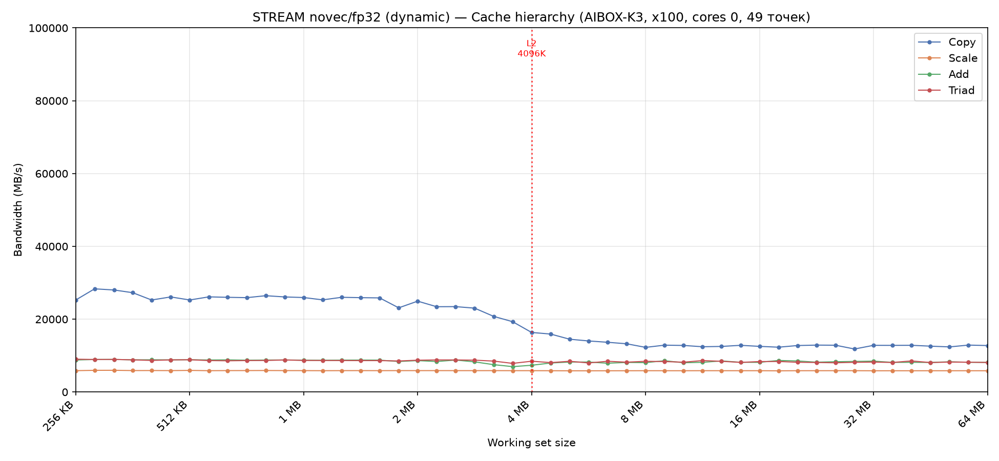
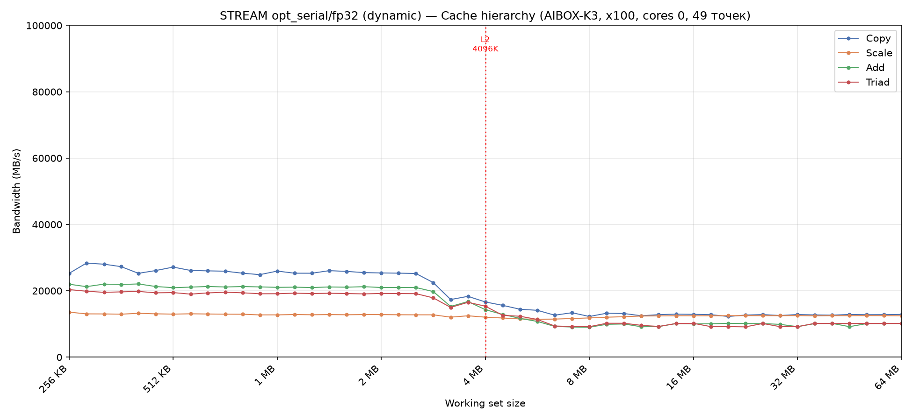
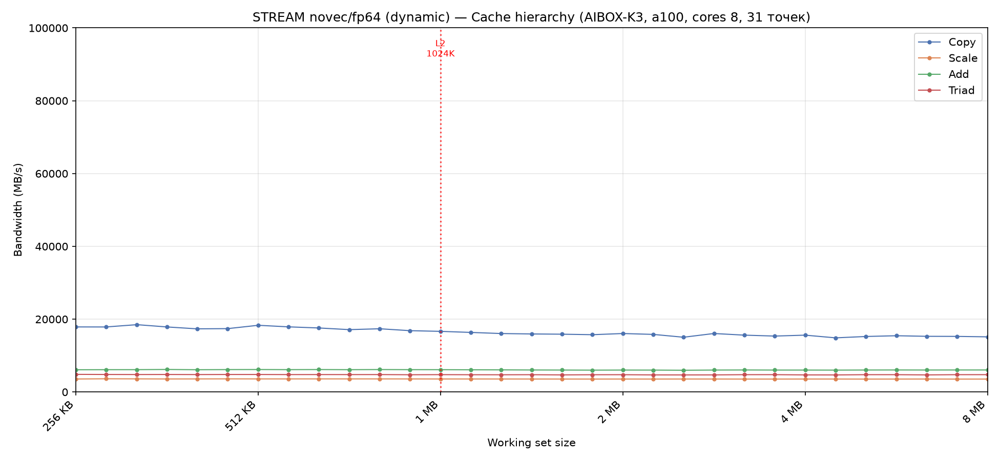
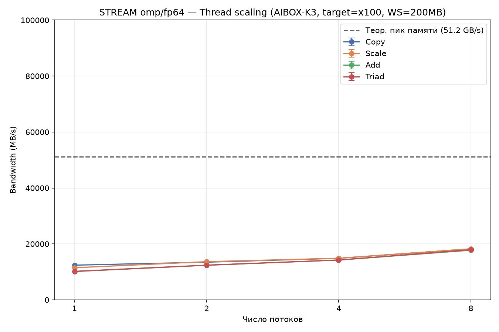
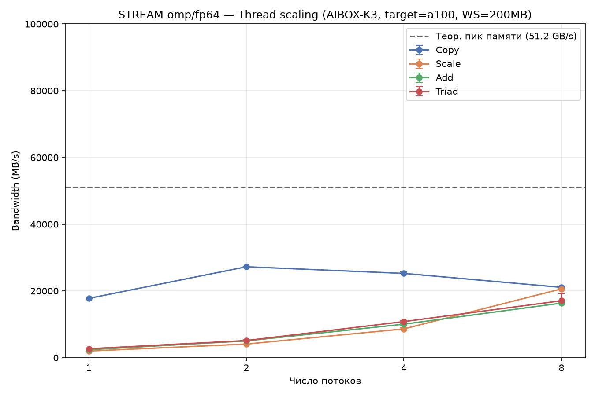

# Сравнение конфигураций STREAM: X100 vs A100, novec vs opt_serial, fp64 vs fp32

## TL;DR

X100 быстрее A100 на арифметике в **2-3×** на одном потоке (Scale: 13000
vs 4200 MB/s; Triad: 9500-13000 vs 4500-5000 MB/s) — несмотря на вчетверо
более широкий вектор A100 (VLEN=1024 vs 256). На 8 потоках разрыв почти
исчезает: X100=18000, A100=17300 MB/s. fp32-арифметика медленнее fp64 при
равном числе элементов (Scale: 6000-6500 vs 13000 MB/s) — контринтуитивно,
не объяснено. Copy инвариантен к типу данных (~13000 MB/s везде — это
`memcpy()`, см. находку 01). Максимум достигнутой эффективности — **35%
от теории** (18000/51200 MB/s, X100, 8 потоков). Оба открытых вопроса
(A100 медленнее, fp32 медленнее fp64) требуют отдельного perf-анализа,
не выполненного в рамках текущего исследования.

## Список измеренных конфигураций

| # | Эксперимент | Кластер | Вариант | Тип | Файл графика |
|---|---|---|---|---|---|
| 1 | cache_sweep | X100 | novec | fp64 | `results/processed/cache_sweep/x100/cache_sweep_novec_fp64_1t_cores0_20260819T132223.png` |
| 2 | cache_sweep | X100 | opt_serial | fp64 | `results/processed/cache_sweep/x100/cache_sweep_opt_serial_fp64_1t_cores0_20260819T132343.png` |
| 3 | cache_sweep | X100 | novec | fp32 | `results/processed/cache_sweep/x100/cache_sweep_novec_fp32_1t_cores0_20260819T132510.png` |
| 4 | cache_sweep | X100 | opt_serial | fp32 | `results/processed/cache_sweep/x100/cache_sweep_opt_serial_fp32_1t_cores0_20260819T132615.png` |
| 5 | cache_sweep | A100 | novec | fp64 | `results/processed/cache_sweep/a100/cache_sweep_novec_fp64_1t_cores8_20260819T151255.png` |
| 6 | standard | X100 | opt_serial | fp64 | `results/processed/standard/x100/opt_serial_fp64_1t_200MB_cores0_20260819T130615.png` |
| 7 | scaling | X100 | opt_serial* | fp64 | `results/processed/scaling/x100/scaling_opt_serial_fp64_x100_200MB_20260819T124253.png` |
| 8 | scaling | X100 | omp | fp64 | `results/processed/scaling/x100/scaling_omp_fp64_x100_200MB_20260819T125809.png` |
| 9 | scaling | A100 | omp | fp64 | `results/processed/scaling/a100/scaling_omp_fp64_a100_200MB_20260819T152303.png` |

*№7 — методологическая ошибка (использован `opt_serial`, не `omp`,
поэтому потоки не размножались, график плоский) — оставлена как
иллюстрация ошибки, актуальный результат — №8.

## 1. Cache_sweep: X100 novec vs opt_serial (fp64)

| Плато в RAM-зоне (>8MB) | Copy | Scale | Add | Triad |
|---|---:|---:|---:|---:|
| novec | ~13000 | ~13000 | ~9500-13000 | ~9500-13000 |
| opt_serial | ~13000 | ~12000* | ~9500-13000 | ~9500-13000 |

*Scale у opt_serial ведёт себя аномально плоско — не реагирует на границу
L2 вообще (подробный разбор в `docs/findings/04_perf_load_store_asymmetry.md`,
где показано, что 80% времени Scale уходит на инструкцию записи).

**Вывод**: разница novec vs opt_serial на плато в RAM практически
отсутствует. Это ожидаемо — в memory-bound режиме (WS >> кэша) узкое
место не в скорости вычислений, поэтому автовекторизация не даёт
заметного выигрыша на этом участке графика (хотя даёт заметный выигрыш
внутри кэша, где режим compute-bound — см. `docs/findings/01_copy_memcpy.md`,
раздел про переход через ridge point Roofline-модели).

## 2. Cache_sweep: X100 fp64 vs fp32

| Плато в RAM-зоне | Copy | Scale | Add | Triad |
|---|---:|---:|---:|---:|
| fp64 (novec) | ~13000 | ~13000 | ~9500-13000 | ~9500-13000 |
| fp32 (novec) | ~13000 | ~6000-6500 | ~7500-8000 | ~7500-8000 |

**Copy инвариантен к типу данных** (~13000 в обоих случаях) — логично,
Copy это `memcpy()` (находка №1), объём данных в байтах одинаков
относительно MB/s метрики. **Арифметика на fp32 заметно медленнее**, чем
на fp64, при равном числе элементов — контринтуитивно (вдвое меньше
байт на элемент должно было бы давать тот же или более высокий MB/s,
если бы было чисто bandwidth-bound). Вероятная причина — накладные
расходы на итерацию цикла (переход, адресная арифметика,
`vsetvli`-настройка) не масштабируются вместе с размером элемента: на
fp32 при том же числе байт трафика требуется **больше итераций цикла**
(меньше байт помещается в один и тот же VLEN), и накладные расходы на
каждую итерацию начинают доминировать сильнее. Отдельно не проверено
через perf/дизассемблер — открытый вопрос для дальнейшего исследования.

## 3. Cache_sweep: X100 vs A100 (novec, fp64)

| Плато в RAM-зоне | X100 | A100 | Отношение |
|---|---:|---:|---:|
| Copy | ~13000 | ~15000-18000 | A100 быстрее |
| Scale | ~13000 | ~4000-4500 | X100 **в ~3× быстрее** |
| Add | ~9500-13000 | ~6000-6500 | X100 **в ~1.7-2× быстрее** |
| Triad | ~9500-13000 | ~4500-5000 | X100 **в ~2-2.5× быстрее** |

A100 имеет вчетверо более широкий векторный регистр (VLEN=1024 бит
против 256 у X100, подтверждено эмпирически через `vlen_probe` на
раннем этапе проекта), но арифметика на нём **медленнее**, а не быстрее.
Copy (memcpy) на A100, наоборот, быстрее — асимметрия между Copy и
арифметикой на A100 даже сильнее, чем на X100. **Не объяснено
количественно** — это открытый вопрос, требующий отдельного `perf stat`
именно на A100 в сравнении с X100 (не выполнено из-за нестабильного
cpuset-доступа к A100 в рамках текущей сессии, см. известную проблему с
`/proc/set_ai_thread`).

## 4. Scaling: рост с числом потоков

| Потоков | X100 Triad | A100 Triad |
|---|---:|---:|
| 1 | ~10100 | ~2500 |
| 2 | ~12300 | ~5200 |
| 4 | ~14400 | ~10900 |
| 8 | ~18000 | ~17300 |

На 8 потоках A100 почти **догоняет** X100 (17300 vs 18000) — несмотря на
то, что на 1 потоке отставал в разы. Это означает, что при полной
загрузке кластера узкое место смещается с "скорости одного ядра" на
"общую пропускную способность памяти, разделяемую между 8 ядрами
кластера" — там, где разница в архитектуре одного ядра (X100 vs A100)
перестаёт быть определяющей. Ни один из двух кластеров не приближается
к теоретическому пику 51.2 GB/s даже на максимальном числе потоков (не
более 35%).

## 5. Эффективность относительно теории — сводная таблица

| Конфигурация | Triad | % от теории (51200 MB/s) |
|---|---:|---:|
| X100, 1 поток | ~10100 | ~20% |
| X100, 8 потоков | ~18000 | ~35% |
| A100, 1 поток | ~2500 | ~5% |
| A100, 8 потоков | ~17300 | ~34% |

## Внешняя валидация

Независимый обзор SpacemiT K3 (CNX Software / sbc-bench, tinymembench)
независимо нашёл ту же низкую пропускную способность памяти на другом
экземпляре платы (`memcpy` = 6045 MB/s, тот же порядок величины, что и
наш Copy) — подробности и точные цифры в
`docs/findings/01_copy_memcpy.md`. Это подтверждает, что низкая
эффективность относительно теории (см. таблицу выше, максимум 35%) —
задокументированная особенность платформы K3, а не ошибка методологии
данного исследования.

## Открытые вопросы (не закрыты в рамках текущего исследования)

1. **Почему A100 медленнее X100 на арифметике на 1 потоке** — нет
   количественного объяснения через perf (не выполнено на A100).
2. **Почему fp32-арифметика медленнее fp64** при равном числе элементов —
   гипотеза про накладные расходы на итерацию не проверена дизассемблером/perf.
3. **Полный scaling на 16 потоках** (X100+A100 одновременно) — не
   измерен из-за нестабильности одновременного cpuset-доступа к обоим
   кластерам.
4. **Весь fp32/fp64 материал в этом отчёте собран BEZ явного `zvfh` в
   `-march`** — по находке №2, это не должно влиять на fp32/fp64 (расширение
   касается только half-precision), но это не проверено явным
   экспериментом. Формально стоит перепроверить хотя бы одну точку.
5. **FP16 не включён в это сравнение** — на момент сбора данных выше FP16
   был сломан (находка №2), стоит пересобрать/перемерить cache_sweep для
   fp16 с исправленным `-march` при наличии времени.
